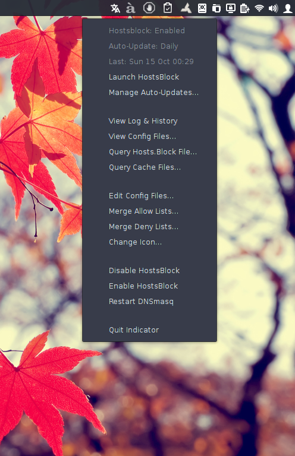

HostsBlock Indicator
=====================

A very simple and lightweight indicator applet to manage hostsblock: https://github.com/gaenserich/hostsblock

Based on the AMD indicator applet here: https://github.com/beidl/amd-indicator



Installation
----------------------

1. ***Use the appropriate deb package provided***: The file **indicator-hostsblock_[amd64|i386]_0.999.x-x.deb** (tested under **Ubuntu 15.04** and **Ubuntu 15.10** only) has been created using `dpkg-deb` to provide a proper installation method, and should install the **hostsblock** and **indicator** together with **dnsmasq** (as dependency) and **kwakd** (the only *amd64/i386-specific* file in the package). After copying all files, it adds the entries "*listen-address=127.0.0.1*" and "*addn-hosts=/etc/hosts.block*" to `/etc/dnsmasq.conf` (if they don't exist already), and starts **dnsmasq** and **kwakd** services (if they are not running already), after which the user can either run **HostsBlock Indicator** application or choose to start using it after logging off and back in.

2. ***Use the "installation script" provided***: Open a terminal window, change (`cd`) to the sub-directory `.../indicator` and enter `./install-hostsblock-indicator.sh` (after **customizing**, if necessary, for non-Debian/GNOME systems).

3. **Manual installation**:

3.1. ***Install dependencies***: **gksu**, **inotify-tools**, **python-appindicator**, **python-gtk2** and **zenity** in addition to *hostsblock dependencies*; **coreutils**, **curl**, **file**, **grep**, **gzip**, **p7zip-full**, **sed** and **unzip**.

3.2. ***Install "hostsblock" as required*** - using the tweaked source files under the `indicator` sub-directory here:
```
	/usr/share/indicator-hostsblock/hostsblock.allow.list
	/usr/share/indicator-hostsblock/hostsblock-common.sh
	/usr/share/indicator-hostsblock/hostsblock.conf
	/usr/share/indicator-hostsblock/hostsblock.deny.list
	/usr/share/indicator-hostsblock/hostsblock.sh
	/usr/share/indicator-hostsblock/hostsblock-urlcheck.sh
	/usr/share/man/man8/hostsblock.8
	/usr/share/man/man8/hostsblock.conf.8
	/usr/share/man/man8/hostsblock-urlcheck.8
```
3.3. ***Install "kwakd" as follows***:
```
	/etc/init.d/kwakd
	/usr/bin/kwakd
	/usr/bin/start-kwakd
	/usr/share/man/man1/kwakd.1
```
3.4. ***Copy "indicator" files like this***:
```
	/etc/xdg/autostart/indicator-hostsblock.desktop
	/usr/share/applications/indicator_hostsblock.desktop
	/usr/share/icons/indicator-hostsblock.svg
	/usr/share/indicator-hostsblock/hostsblock-indicator
	/usr/share/indicator-hostsblock/hostsblock-check-updates
	/usr/share/indicator-hostsblock/hostsblock-launcher
	/usr/share/indicator-hostsblock/indicator-hostsblock
	/usr/share/indicator-hostsblock/hostsblock.svg
	/usr/share/indicator-hostsblock/hostsblock-color.svg
	/usr/share/indicator-hostsblock/hostsblock-dark.svg
	/usr/share/indicator-hostsblock/hostsblock-light.svg
```

Change log
----------------------

- **0.999.3-14:** New menu items "View History", "Query Hosts.Block File" and "Query Cache Files", plus several small fixes
- **0.999.3-13:** Most scripts merged into a single "backend" script (as functions)
- **0.999.3-12:** Changed icons
- **0.999.3-11:** Smarter use of sudo command
- **0.999.3-10:** Fixed kwakd pathnames and updated icons
- **0.999.3-09:** Fixed the issue with deb reinstallation and upgrades by moving upstream hostsblock files also into indicator directory
- **0.999.3-08:** Fixed important bugs associated with awk commands in some scripts
- **0.999.3-07:** Both **hostsblock** and **indicator** moved to `/usr/share/` to avoid **lintian errors**
- **0.999.3-06:** Improved View/Edit Config Files menu items, and hostsblock.conf format
- **0.999.3-05:** Added quit menu item and polished menu further
- **0.999.3-04:** Indicator now automatically refreshes after a change in program directory (e.g. log, icon)
- **0.999.3-03:** Added user black/white lists feature and fixed some bugs
- **0.999.3-02:** Fixed indicator restart failure after launcher cron job
- **0.999.3-01:** Minor upstream updates, added hostsblock man files
- **0.999.2-03:** Added kwakd man file
- **0.999.2-02:** Added launcher no update notification
