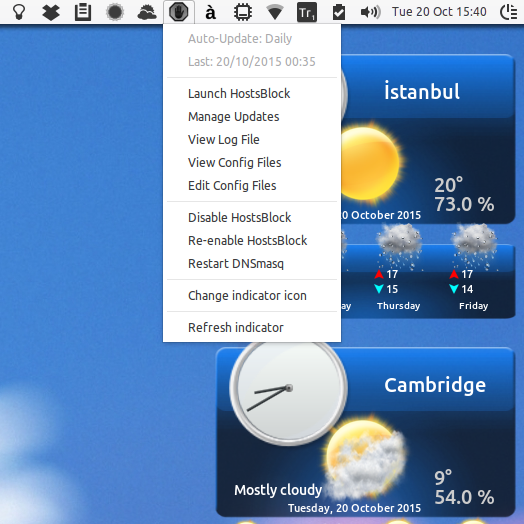

indicator-hostsblock
=====================

A very simple and lightweight indicator applet to manage hostsblock: https://github.com/gaenserich/hostsblock

Based on the AMD indicator applet here: https://github.com/beidl/amd-indicator



Prerequisites
----------------------

Install **python-appindicator**, **python-gtk2**, **zenity** and **gksu** - in addition to other **hostsblock dependencies**, including **recommended** ones such as **p7zip-full** package.

Manual installation
----------------------

Install **hostsblock** as required - for example:
```
	/usr/local/lib/hostsblock-common.sh
	/etc/hostsblock/black.list
	/etc/hostsblock/hostsblock.conf
	/etc/hostsblock/hostsblock.sh
	/etc/hostsblock/hostsblock-urlcheck.sh
	/etc/hostsblock/white.list
```
Then copy **hostsblock-indicator** files like this:
```
	/etc/xdg/autostart/indicator-hostsblock.desktop
	/usr/local/indicator-hostsblock/change-icon-gui
	/usr/local/indicator-hostsblock/check-updates
	/usr/local/indicator-hostsblock/disable-hostsblock
	/usr/local/indicator-hostsblock/editor-gui
	/usr/local/indicator-hostsblock/enable-hostsblock
	/usr/local/indicator-hostsblock/hostsblock.png
	/usr/local/indicator-hostsblock/hostsblock-color.png
	/usr/local/indicator-hostsblock/hostsblock-dark.png
	/usr/local/indicator-hostsblock/hostsblock-light.png
	/usr/local/indicator-hostsblock/indicator-hostsblock
	/usr/local/indicator-hostsblock/launcher
	/usr/local/indicator-hostsblock/launcher-gui
	/usr/local/indicator-hostsblock/restart-dnsmasq
	/usr/local/indicator-hostsblock/restart-indicator
	/usr/local/indicator-hostsblock/scheduler-gui
	/usr/local/indicator-hostsblock/status_auto-update
	/usr/local/indicator-hostsblock/status_last-update
	/usr/local/indicator-hostsblock/viewer-gui
	/usr/share/applications/indicator_hostsblock.desktop
```

Deb package
----------------------

The file **indicator-hostsblock_amd64_0.999.2-1.deb**, which has only been tested under Ubuntu 15.04, has been created using `dpkg-deb` to provide a proper installation method. It should install the **hostsblock** and *indicator** together with **dnsmasq** (as dependency) and **kwakd** (which is the only *amd64-specific* item in the package). It first stops the hostsblock-indicator, if running, and deletes the directory `/usr/local/indicator-hostsblock/`, if exists. After copying all necessary files, it makes a couple of minor modifications in the original /etc/hostsblock/hostsblock.conf` file (i.e. using a separate `/etc/hosts.block` file instead of `/etc/hosts`, using `0.0.0.0` instead of `127.0.0.1` for localhost redirection to produce a smaller file, and commenting out several blocklists for a more modest size), adds necessary entries "*listen-address=127.0.0.1*" and "*addn-hosts=/etc/hosts.block*" to `/etc/dnsmasq.conf`, if necessary, and starts **dnsmasq** and **kwakd** services, if not already running, after which user can either run **HostsBlock Indicator** application or choose to start using it after logging off and back in.

Info about some files
----------------------

1. The file **indicator-hostsblock** is a simple python script (originally found here: https://github.com/beidl/amd-indicator) that adds an indicator to the system tray (Unity top panel) to easily manage the original hostsblock utility, using several scripts added here. 

2. The file **launcher** merely launches `/etc/hostsblock/hostsblock.sh` with verbosity level 3, creates a log file, and sends a graphical notification of the result ("**no updates**" or "**x updates**") to user(s).

3. The file **check-updates** is actually a clipping of the original **hostsblock.sh** script, which merely checks the blocklists, and (unsuccessfully) attempts to download and overwrite those that have changed since the last update in the system cache, and then allows replacing such failure messages with a "**change found**" statement in **launcher-gui**.

4. The file **launcher-gui** is a simple zenity-based script that starts the **check-updates** script, informs the user when there are updates, and asks if they would like hostsblock to update. If Yes, the user is required to enter their password, and hostsblock is launched similar to **launcher**, and then the user is asked if they would like to view the log file.

5. The file **scheduler-gui** is a simple zenity-based script which checks all cron directories (/etc/cron.hourly,daily,weekly,monthly) for the file (or symlink) **hostsblock-launcher** (aka **launcher**) to inform the user how hostsblock is scheduled to run, and asks if they would like to change it, and then implements the user's choice.

6. The files **viewer-gui** and **editor-gui** are simple zenity-based scripts that allow the user to view/edit configuration file(s) they choose from a list (`/etc/hosts.block`; `/etc/hostsblock/hostsblock.conf`,`black.list`,`white.list`).

7. The file **change-icon-gui** is a simple zenity-based script that allows the user to change the indicator icon (color/dark/light).
