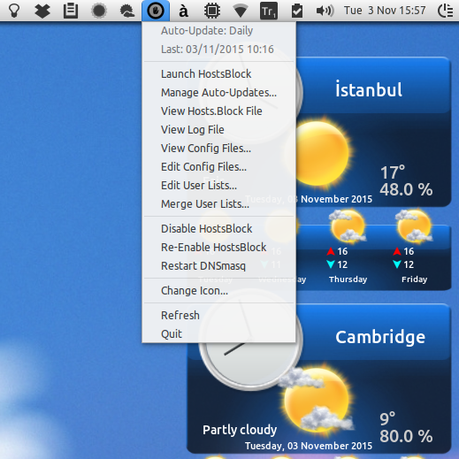

indicator-hostsblock
=====================

A very simple and lightweight indicator applet to manage hostsblock: https://github.com/gaenserich/hostsblock

Based on the AMD indicator applet here: https://github.com/beidl/amd-indicator



Prerequisites
----------------------

Install **gksu**, **python-appindicator**, **python-gtk2**, **zenity** and **inotify-tools** - in addition to other **hostsblock dependencies**, including **recommended** ones such as **p7zip-full** package.

Manual installation
----------------------

Install **hostsblock** as required - for example:
```
	/usr/share/hostsblock/black.list
	/usr/share/hostsblock/hostsblock.conf
	/usr/share/hostsblock/hostsblock.sh
	/usr/share/hostsblock/hostsblock-urlcheck.sh
	/usr/share/hostsblock/white.list
	/usr/share/hostsblock-common.sh
	/usr/share/man/man8/hostsblock.8
	/usr/share/man/man8/hostsblock.conf.8
	/usr/share/man/man8/hostsblock-urlcheck.8
```
Install **kwakd** (can be extracted from deb archive file) as follows:
```
	/etc/init.d/kwakd
	/usr/bin/kwakd
	/usr/bin/start-kwakd
	/usr/share/man/man1/kwakd.1
```
Then copy **hostsblock-indicator** files like this:
```
	/etc/xdg/autostart/indicator-hostsblock.desktop

	/usr/share/indicator-hostsblock/auto-refresh
	/usr/share/indicator-hostsblock/change-icon-gui
	/usr/share/indicator-hostsblock/check-updates
	/usr/share/indicator-hostsblock/disable-hostsblock
	/usr/share/indicator-hostsblock/editor-gui
	/usr/share/indicator-hostsblock/edit-user-gui
	/usr/share/indicator-hostsblock/enable-hostsblock
	/usr/share/indicator-hostsblock/hostsblock-color.png
	/usr/share/indicator-hostsblock/hostsblock-dark.png
	/usr/share/indicator-hostsblock/hostsblock-light.png
	/usr/share/indicator-hostsblock/hostsblock.png
	/usr/share/indicator-hostsblock/indicator-hostsblock
	/usr/share/indicator-hostsblock/launcher
	/usr/share/indicator-hostsblock/launcher-gui
	/usr/share/indicator-hostsblock/merge-user-gui
	/usr/share/indicator-hostsblock/restart-dnsmasq
	/usr/share/indicator-hostsblock/restart-indicator
	/usr/share/indicator-hostsblock/scheduler-gui
	/usr/share/indicator-hostsblock/status_auto-update
	/usr/share/indicator-hostsblock/status_last-update
	/usr/share/indicator-hostsblock/viewer-gui
	/usr/share/indicator-hostsblock/view-hostsblock-gui
	/usr/share/indicator-hostsblock/view-log-gui

	/usr/share/applications/indicator_hostsblock.desktop
```

Deb package
----------------------

The file **indicator-hostsblock_[amd64|i386]_0.999.x-x.deb**, which has only been tested under **Ubuntu 15.04** and **Ubuntu 15.10**, has been created using `dpkg-deb` to provide a proper installation method. It should install the **hostsblock** and **indicator** together with **dnsmasq** (as dependency) and **kwakd** (which is the only *amd64/i386-specific* file in the package). After copying all files, it adds the entries "*listen-address=127.0.0.1*" and "*addn-hosts=/etc/hosts.block*" to `/etc/dnsmasq.conf`, if necessary, and starts **dnsmasq** and **kwakd** services, if not already running, after which user can either run **HostsBlock Indicator** application or choose to start using it after logging off and back in.

Info about some files
----------------------

This fork includes - in addition to change of directory from `/etc/hostsblock` to `/usr/share/hostsblock` - several minor modifications in the upstream `hostsblock.conf` file (i.e. using a separate `/etc/hosts.block` file instead of `/etc/hosts`, using `0.0.0.0` instead of `127.0.0.1` for *localhost redirection* to produce a smaller file, and commenting out several blocklists for a more modest size), and also several minor modifications in other configuration files. The main change is the subdirectory **indicator** and its contents as follows:

1. The file **indicator-hostsblock** is a simple python script (originally found here: https://github.com/beidl/amd-indicator) that adds an indicator to the system tray (Unity top panel) to easily manage the original hostsblock utility, using several scripts added here. 

2. The file **launcher** merely launches `/usr/share/hostsblock/hostsblock.sh` with verbosity level 3, creates a log file, and sends a **graphical notification** of any updates to user(s).

3. The file **check-updates** is actually a clipping of the original **hostsblock.sh** script, which merely checks the blocklists, and (unsuccessfully) attempts to download and overwrite those that have changed since the last update in the system cache, and then allows replacing such failure messages with a "**change found**" statement in **launcher-gui**.

4. The file **launcher-gui** is a simple zenity-based script that starts the **check-updates** script, informs the user when there are updates, and asks if they would like hostsblock to update. If Yes, the user is required to enter their password, and hostsblock is launched similar to **launcher**, and then the user is asked if they would like to view the log file.

5. The file **scheduler-gui** is a simple zenity-based script which checks all cron directories (/etc/cron.hourly,daily,weekly,monthly) for the file (or symlink) **hostsblock-launcher** (aka **launcher**) to inform the user how hostsblock is scheduled to run, and asks if they would like to change it, and then implements the user's choice.

6. The files **viewer-gui** and **editor-gui** are simple zenity-based scripts that allow the user to view/edit configuration file(s) they choose from a list (`/etc/hosts.block`; `/usr/share/hostsblock/hostsblock.conf`,`black.list`,`white.list`).

7. The file **change-icon-gui** is a simple zenity-based script that allows the user to change the indicator icon (color/dark/light).

8. The file **edit-user-gui** is a simple zenity-based script that allows the user to create/edit user-specific lists for **black.list** and **white.list** under subfolder `~/.local/share/indicator-hostsblock/` which can afterwards be used to merge into those corresponding hostsblock configuration files at `/usr/share/hostsblock/`.

9. The file **auto-refresh**, which is automatically executed when the main python script starts, monitors the directory `/usr/share/indicator-hostsblock` so as to restart/refresh the indicator whenever its contents are modified, e.g. in the event of a change of indicator icon or hostsblock.log file (the source of last update date and time displayed at the top of the menu).

Change log
----------------------

- **indicator-hostsblock_[amd64|i386]_0.999.3-6.deb:** Both **hostsblock** and **indicator** moved to `/usr/share/` to avoid the **lintian errors** that emerged in previous versions
- **indicator-hostsblock_[amd64|i386]_0.999.3-6.deb:** Improved View/Edit Config Files menu items, and hostsblock.conf format
- **indicator-hostsblock_[amd64|i386]_0.999.3-5.deb:** Added quit menu item and polished menu further
- **indicator-hostsblock_[amd64|i386]_0.999.3-4.deb:** Indicator now automatically refreshes after a change in program directory, including **hostsblock.log** and indicator icon, i.e. **hostsblock.png**
- **indicator-hostsblock_[amd64|i386]_0.999.3-3.deb:** Added user black/white lists feature and fixed some bugs
- **indicator-hostsblock_[amd64|i386]_0.999.3-2.deb:** Fixed indicator restart failure after launcher cron job
- **indicator-hostsblock_[amd64|i386]_0.999.3-1.deb:** Minor upstream updates, added hostsblock man files
- **indicator-hostsblock_[amd64|i386]_0.999.2-3.deb:** Added kwakd man file
- **indicator-hostsblock_amd64_0.999.2-2.deb:** Added launcher no update notification
